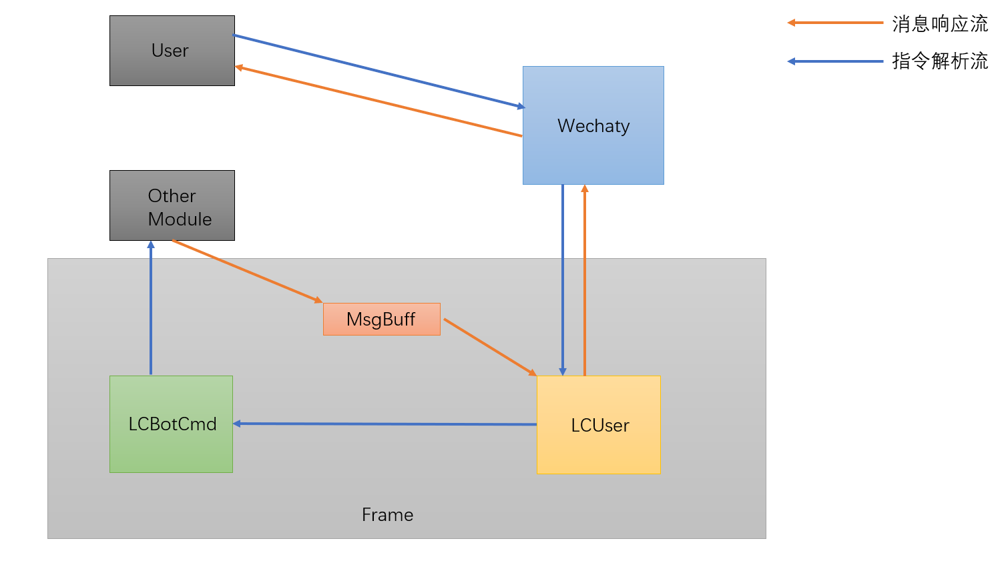
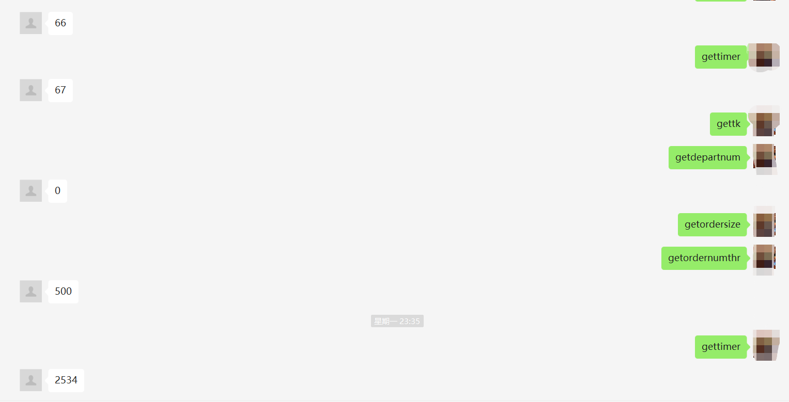
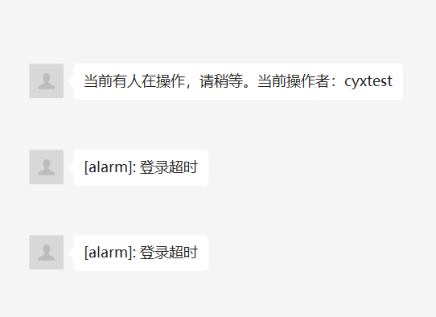

# 基于wechaty的简易多用户异步交互框架

## 背景介绍

最近在编写一个服务端的程序，由于程序运行于远端，为了便于实时监控程序运行状态以及处理结果，同时又不希望记录过多运行时日志，因此考虑使用基于wechaty作为人机交互接口的解决方案。


## 应用场景

该框架提供一种**人机交互的解决方案**，可应用的场景包括但不限于**流程控制**、**状态监测**以及**告警通报**。该框架支持**多用户分级管理**，让合适的用户获取合适的信息是一个比较常规的设计，防止过多接口暴露导致信息泄露；同时框架也支持**消息异步通知**，多用户场景下需要解决的一个重要问题就是冲突，框架提供一种简单的解决冲突的方式。


## 整体结构

<center>
    
    <br>
    <div style="color:orange; border-bottom: 1px solid #d9d9d9;
    display: inline-block;
    color: #999;
    padding: 2px;">模块交互</div>
</center>


用户与系统交互可以使用两条流来描述。用户下发指令到Wechaty机器人，机器人将指令封装后传递给框架解析（封装后的指令携带指令下发者信息），框架的LCUser模块辅助LCBotCmd对消息进行鉴权，如果用户没有权限执行该指令，指令下发将会终止，起到用户分级目的；反之如果用户有权执行该指令则LCBotCmd模块会解析指令并到目标模块获取结果，这条流称为**指令解析流**。目标模块将指令执行结果返回到存储到消息队列，Wechaty通过从消息队列周期性的获取消息分发给用户，从而实现多用户异步交互，这条流称为**消息响应流**。还有一些琐碎的事件没有在图中表现出来，比如指令注册与注销，用户添加与删除，用户提权与降权等，大家可以参考模块设计自行发挥。

## 模块设计

Frame框架共由三个子模块实现，为了简化设计我将MsgBuff模块固定实现为`queue.Queue(-1)`，其表示一个容量无穷大(理论上)的同步队列。LCBotCmd与LCUser模块见下：

### LCBotCmd

为了能够对指令类型和指令特权级进行区分，需要给每条指令绑定一个类型标志和特权标志，那么这两个标志可以这样定义：

```python
class CMDTYPE(Enum):
    C_GET = 0
    C_SET = 1
    C_QUIT = 2
    C_NONE = 3
    
class CMDPRI(IntEnum):
    CP_ROOT = 0
    CP_ADMIN = 1
    CP_USER = 2
```

之所以让`CMDTYPE`继承`Enum`而`CMDPRI`继承`IntEnum`是因为类型不涉及大小比较，而特权需要大小比较。

之后就可以对单个指令的属性进行配置了：

```python
class CMD:
    def __init__(self):
        self.type = CMDTYPE.C_NONE
        self.name = None
        self.privilege = None
        self.call_func = None
        
        self.username = None
        self.extra = None
```

每一条指令有两个使用场景：**注册**和**解析**，因此我为指令增加了两种场景下所需的属性。其中`type`、`name`、`privilege`、`call_func`用于注册场景，`username`、`extra`、`privilege`用于指令解析场景，这里`extra`参数表示设置类指令需要携带的信息，`privilege`即用于注册场景也用于解析场景，用于注册时表示执行该指令需要的**最低特权**，用于解析时表示该**指令执行者的特权级**。

对于指令的两种场景，我们需要不同的方法构造他们：

```python
	@staticmethod
    def construct_for_exec(cmd, extra, user):
        c = CMD()
        c.name = cmd
        c.extra = extra
        c.username = user.getName()
        c.privilege = user.getPri()
        return c

    @staticmethod
    def construct_for_registe(type, cmd, privilege, func):
        c = CMD()
        c.type = type
        c.name = cmd
        c.privilege = privilege
        c.call_func = func
        return c
```

构造函数不依赖于对象，因此使用静态函数。

最后需要做的就是让指令执行起来：

```python
	def do(self, extra, username):
        self.call_func(extra, username)
```

直接调用指令的回调让指令跑起来，`extra`对于非设置类指令为<font color=' LightPink'>*None*</font>，配置类指令时就是附加的信息。可能`extra`和`username`两个参数在这里会显得比较突兀，因为指令属性里边就带有这两个参数，我们本可以直接将回调函数中用到这两个参数的地方替换为`self.extra`和`self.username`，目前看来似乎传入这两个参数是多此一举的<sup>q1</sup>，别慌，继续往下看。

指令已经实现了，接下来就该实现指令集了：

```python
class Cmdmanager:
    _instance_lock = threading.Lock()

    def __init__(self):
        self.cmds = {}

    # 注册命令
    def reg_cmd(self, cmd:CMD):
        if cmd.type is None or cmd.privilege is None or cmd.call_func is None:
            return
        if cmd.name in self.cmds:
            return
        self.cmds[cmd.name] = cmd

    # 修改命令
    def update_cmd(self, cmd:CMD):
        if cmd.type is None or cmd.privilege is None or cmd.call_func is None:
            return
        if cmd.name in self.cmds:
            self.cmds[cmd.name] = cmd

    # 注销命令
    def unreg_cmd(self, name:str):
        if name in self.cmds:
            self.cmds.pop(name)

    # 执行命令
    def run_cmd(self, cmd:CMD):
        if cmd.privilege > self.cmds[cmd.name].privilege or cmd.username is None:
            return
        if self.cmds[cmd.name].type == CMDTYPE.C_SET and cmd.extra is None:
            return
        func = self.cmds[cmd.name].do
        work = threading.Thread(target=func, args=(cmd.extra,cmd.username,), daemon=False)
        work.start()

    @classmethod
    def instance(cls):
        if not hasattr(Cmdmanager, "_instance"):
            with Cmdmanager._instance_lock:   # 为了保证线程安全在内部加锁
                if not hasattr(Cmdmanager, "_instance"):
                    Cmdmanager._instance = Cmdmanager()
        return Cmdmanager._instance
```

实现一个指令管理类，简单的将注册的指令存放到一个字典中，方便对指令进行增删改，同时每个指令的执行都实现为在线程中执行，以达到消息异步响应的效果。同时，在函数`run_cmd`中就可以解决*q1*的疑问了：**因为注册到指令集中的指令跟实际执行的指令不是同一个！**

### LCUser

LCUser的模块设计就比较简单了，需要一个定义用户的类以及一个管理用户集的类(与LCBotCmd模块结构相似)，一种可能的实现为：

```python
class LCUser:
    def __init__(self, name, right):
        self.name = name
        self.right = right

    def getName(self):
        return self.name

    def setName(self, name):
        self.name = name

    def updetePri(self, right):
        self.right = right

    def getPri(self):
        return self.right

class UserManager:
    _instance_lock = threading.Lock()

    def __init__(self, filepath):
        self.users = {}
        self.loadConfig(filepath)

    def loadConfig(self, filepath):
        try:
            file = open(filepath, 'rb')
            jsonfile = json.load(file)
        except Exception:
            pass
        for u in jsonfile:
            name = u['name']
            right = CMDPRI(u['right'])
            user = LCUser(name, right)
            self.users[name] = user

    def getUsers(self):
        return self.users

    @classmethod
    def instance(cls):
        if not hasattr(UserManager, "_instance"):
            with UserManager._instance_lock:   # 为了保证线程安全在内部加锁
                if not hasattr(UserManager, "_instance"):
                    UserManager._instance = UserManager("D:\\code\\git\\hpv\\LCUser\\userconfig.json")
        return UserManager._instance
```

目前实现比较简单，通过加载配置文件的方式管理用户集，当然使用者可以通过定义增、删函数对用户进行管理，甚至可以用数据库来持久化数据。

### Wechaty如何集成框架

Wechaty拥有天然的优势，简单的接口为框架提供了基础设施，通过对接微信，相当于拥有一个自动用户管理的平台；通过事件循环提供及时准确的消息，更加方便用户与系统的交互。框架提供了简单的接口给Wechaty进行调用：

```python
from wechaty import Wechaty

class LcBot(Wechaty):
    def __init__(self):
        super(LcBot, self).__init__()
        self.quit = False

        self.reg_cmd()

    def reg_cmd(self):
        Cmdmanager.instance().reg_cmd(CMD.construct_for_registe(CMDTYPE.C_BREAK, 'quit', CMDPRI.CP_ROOT, self.die))

    def die(self, extra, username):
        self.quit = True

	async def on_message(self, msg):
        content = msg.text().split(':')
        talker = msg.talker()
        if talker.name in UserManager.instance().getUsers():
            user = UserManager.instance().getUsers()[talker.name]
            if len(content) > 1:
                cmd = CMD.construct_for_exec(content[0], content[1], user)
            else:
                cmd = CMD.construct_for_exec(content[0], None, user)
            Cmdmanager.instance().run_cmd(cmd)
```

这段简短的代码展示了框架的基本功能，`reg_cmd`函数调用框架的命令注册接口进行命令注册，类似的，其他模块也可以在需要的地方进行命令的注册。在`on_message`函数中，框架对指令执行者进行了初步鉴别，然后调用`construct_for_exec`函数生成待执行命令，最后送到`run_cmd`函数进行处理。整个流程就是这么简单，读者可以自行扩展。

## 效果展示

<center>
    
    <br>
    <div style="color:orange; border-bottom: 1px solid #d9d9d9;
    display: inline-block;
    color: #999;
    padding: 2px;">命令响应</div>
</center>

<center>
    
    <br>
    <div style="color:orange; border-bottom: 1px solid #d9d9d9;
    display: inline-block;
    color: #999;
    padding: 2px;">告警提示</div>
</center>


## 篇末总结

多用户异步消息处理框架与Wechaty相辅相成，其设计简单小巧，虽然无法应对复杂多变的互联网，但复杂的东西我们总可以将他们抽象为逻辑过程交给计算机去完成，我们只需要监视并控制机器就行了，而Wechaty和多用户异步消息处理框架的配合达到了这个效果。
