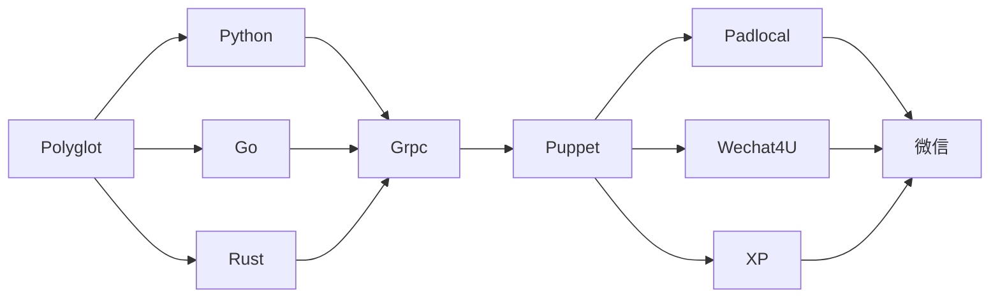
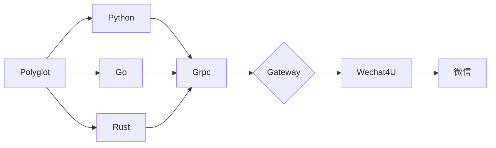
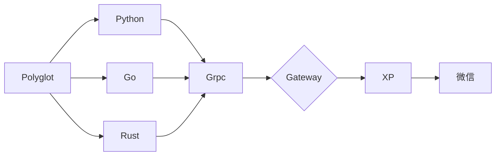

## 前言

### 声明

1. wechaty 属于开源工具，并没有太多的义务帮你解决问题
2. 大家也多是一步一步学习的，工具做好了基本也潜水了
3. 所以请尝试自己查找资料
4. 我喜欢go嘛

### 提问的艺术

1. 其实 [wechaty官网](https://wechaty.js.org/) 已经很详细了，这里有很多的文档可供参考
2. 使用谷歌语法 `wechaty go xp`
3. 使用 Github 搜索 `org:wechaty roomInvitation`
4. 请将你的`问题，代码，错误日志`一起提交到 issues
5. 希望你能接受上面的说法，感谢

### 关于架构



## Wechat4U

- 首先确定你能不能使用网页版登录
- Wechat4U Token 不需要钱，随机生成就好
- 下面这一套不需要 docker，安装简单



### Gateway

```bash
npm install -g wechaty wechaty-puppet-wechat4u
# npm --registry https://registry.npm.taobao.org install -g wechaty wechaty-puppet-wechat4u

export WECHATY_PUPPET="wechaty-puppet-wechat4u"
export WECHATY_TOKEN="d6e8b1c7-6fcd-4e32-b3f6-8d1e73388458"
# export WECHATY_TOKEN=$(curl -s https://www.uuidgenerator.net/api/version4)

export WECHATY_PUPPET_SERVICE_TOKEN="insecure_d6e8b1c7-6fcd-4e32-b3f6-8d1e73388458"
# export WECHATY_PUPPET_SERVICE_TOKEN="insecure_$(curl -s https://www.uuidgenerator.net/api/version4)"

export WECHATY_LOG="verbose"
export WECHATY_PUPPET_SERVER_PORT="25000"
export WECHATY_PUPPET_SERVICE_NO_TLS_INSECURE_SERVER=true

wechaty gateway --puppet ${WECHATY_PUPPET} --port ${WECHATY_PUPPET_SERVER_PORT} --token ${WECHATY_PUPPET_SERVICE_TOKEN} --puppet-token ${WECHATY_TOKEN}
```

上面这些就是网关啦，希望你能使用它来作为你的常用工具

wechaty 会在当前目录生成 `Gateway.memory-card.json`  有了这个文件就不需要总是重新登陆了

### Polyglot(wechat4u)

```go
// 其他的官网 demo 照抄就OK，这个使用的是 go-wechaty
// demo: https://github.com/wechaty/go-wechaty/blob/master/examples/ding-dong-bot.go
var bot = wechaty.NewWechaty(wechaty.WithPuppetOption(wp.Option{
    Token: "insecure_d6e8b1c7-6fcd-4e32-b3f6-8d1e73388458",
    Endpoint: "127.0.0.1:25000",
    Timeout: time.Second * 10,
}))
```

## XP

- 相比而言，padLocal 协议更稳定
- XP Token 不需要钱，随机生成就好
- 下面这一套不需要 docker，安装简单
- 安装[微信](https://github.com/wechaty/wechaty-puppet-xp/releases/download/v0.5/WeChatSetup-v3.3.0.115.exe)
- Demo : [Go-wechaty-Bot](https://github.com/Ran-Xing/Go-wechaty-Bot) - 欢迎下载体验、踢出宝贵的修复建议



### Gateway(wechat4u)

```bash
# 这些仅适用于 Windows，因为 xp 支持的是Windows版本微信
npm install -g wechaty wechaty-puppet-xp
# npm --registry https://registry.npm.taobao.org install -g wechaty wechaty-puppet-xp

set WECHATY_PUPPET="wechaty-puppet-xp"
set WECHATY_TOKEN="d6e8b1c7-6fcd-4e32-b3f6-8d1e73388458"
# set WECHATY_TOKEN=$(curl -s https://www.uuidgenerator.net/api/version4)

set WECHATY_PUPPET_SERVICE_TOKEN="insecure_d6e8b1c7-6fcd-4e32-b3f6-8d1e73388458"
# set WECHATY_PUPPET_SERVICE_TOKEN="insecure_$(curl -s https://www.uuidgenerator.net/api/version4)"

set WECHATY_LOG="verbose"
set WECHATY_PUPPET_SERVER_PORT="25000"
set WECHATY_PUPPET_SERVICE_NO_TLS_INSECURE_SERVER=true

wechaty gateway --puppet %WECHATY_PUPPET% --port %WECHATY_PUPPET_SERVER_PORT% --token %WECHATY_PUPPET_SERVICE_TOKEN% --puppet-token %WECHATY_TOKEN%
```

上面这一堆麻烦的东西就是网关啦，希望你能使用它来作为你的好助手！

### Polyglot(xp)

```go
// 其他的官网 demo 照抄就OK，这个使用的是 go-wechaty
// demo: https://github.com/wechaty/go-wechaty/blob/master/examples/ding-dong-bot.go
var bot = wechaty.NewWechaty(wechaty.WithPuppetOption(wp.Option{
    Token: "insecure_d6e8b1c7-6fcd-4e32-b3f6-8d1e73388458",
    Endpoint: "127.0.0.1:25000",
    Timeout: time.Second * 10,
}))
```

## Padlocal

### Gateway(padlocal)

```bash
# 初始化
mkdir bot; cd bot; npm init -y

npm install wechaty wechaty-puppet-padlocal // 安装全局报错找不到包
# npm --registry https://registry.npm.taobao.org install wechaty wechaty-puppet-padlocal

export WECHATY_PUPPET="wechaty-puppet-padlocal"
export WECHATY_TOKEN="puppet_padlocal_xxxxxxxxxxxxxxxxxxxxxxxxxxxxxx"
# get from http://pad-local.com/#/

export WECHATY_PUPPET_SERVICE_TOKEN="insecure_d6e8b1c7-6fcd-4e32-b3f6-8d1e73388458"
# export WECHATY_PUPPET_SERVICE_TOKEN="insecure_$(curl -s https://www.uuidgenerator.net/api/version4)"

export WECHATY_LOG="verbose"
export WECHATY_PUPPET_SERVER_PORT="25000"
export WECHATY_PUPPET_SERVICE_NO_TLS_INSECURE_SERVER=true
export PATH="$PATH:$(pwd)/node_modules/.bin" // 这句很重要
wechaty gateway --puppet ${WECHATY_PUPPET} --port ${WECHATY_PUPPET_SERVER_PORT} --token ${WECHATY_PUPPET_SERVICE_TOKEN} --puppet-token ${WECHATY_TOKEN}
```

### Polyglot(padlocal)

```go
import puppet "github.com/wechaty/go-wechaty/wechaty-puppet"
var bot = wechaty.NewWechaty(wechaty.WithPuppetOption(puppet.Option{
    Token: "insecure_d6e8b1c7-6fcd-4e32-b3f6-8d1e73388458",
    Endpoint: "127.0.0.1:25000",
    Timeout: time.Second * 10,
  }))
```

## 性能对比

### Gateway(xp)

```bash
func OnScan(ctx *wechaty.Context) {
    os.exit(0)
---------------------------------------
➜  time go run test.go
2022/04/13 22:09:40 PuppetService Start()
2022/04/13 22:09:42 PuppetService onGrpcStreamEvent({type:EVENT_TYPE_HEARTBEAT payload:{"data":"Wechaty Puppet gRPC stream connect successfully"}})
2022/04/13 22:09:42 PuppetService onGrpcStreamEvent({type:EVENT_TYPE_SCAN payload:{"qrcode":"https://login.weixin.qq.com/l/IeJ_ESMXqQ==","status":2}})
go run test.go  0.46s user 0.32s system 27% cpu 2.895 total
```

### TypeScript

```bash
function onScan(payload: PUPPET.payloads.EventScan) {
    return process.exit(0);
---------------------------------------
time cross-env NODE_OPTIONS="--no-warnings --loader=ts-node/esm" node examples/1.ts
Puppet Version: 0.0.0<1.18.3>
Please wait... I'm trying to login in...

cross-env NODE_OPTIONS="--no-warnings --loader=ts-node/esm" node examples/1.t  0.40s user 0.13s system 54% cpu 0.975 total
```

因为大部分兄弟的微信是不能登录网页版而选的 XP 协议，所以我想说，XP 协议需要 Hook 微信进程，TypeScript 将需要更多的时间

## 设计思路

- Viper 用来读取或者写入配置文件，包括 各种 token
- go func()  // 这里我并不理解这个，我以为他是 后台程序
- strings.Replace 切割 @ 符号和机器人的名字，机器人的名字可以在 onlogin 的时候读取
- 在 message 接收到消息的时候，如果匹配到了关键字，其实你可以把它放到后台继续执行的
- 还有就是 xp 消息发送过于频繁怕触发微信的风控
- golang 可以使用 air 热重启，typescript 使用 nodemon

## 关于文档贡献

> 如果你喜欢这款开源机器人，且愿意与大家分享你的心得，欢迎投稿
> 参与投稿，你将获得 长期 `padlocal token` ,更稳定！
> 那么，关于文档，由于文章较多，我的解决方案是 `vscode` + `Plug markdownlint` + [`markdownlint Config`](https://github.com/wechaty/jekyll/blob/main/.markdownlint.json)
