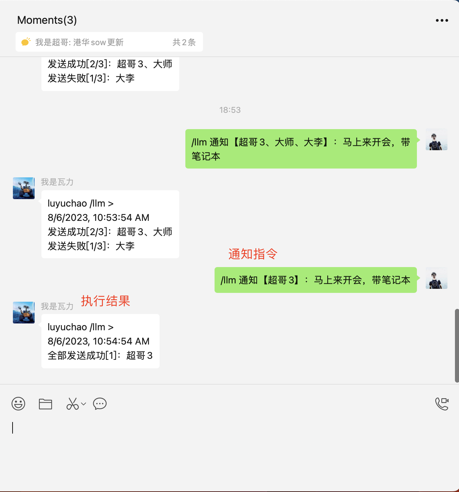
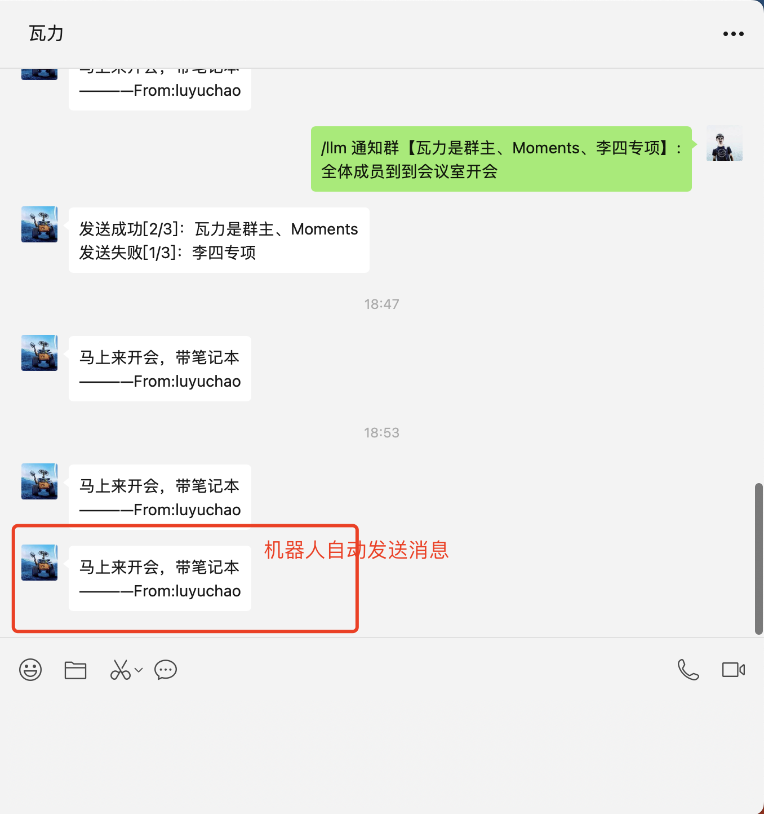

随着ChatGPT火爆，LLM应用如雨后春笋，层出不穷。几乎任何人都可以基于大预言模型开发出自己的天猫精灵、小爱同学、小度小度...

今天我将向大家介绍一个基于ChatGPT开发的使用自然语言控制微信方案。使用LLM控制wechaty机器人执行各种命令，wechaty+ [TypeChat](https://github.com/microsoft/TypeChat) 的结合，已实现以下功能（完整代码查看[type-wechaty https://github.com/atorber/type-wechaty](https://github.com/atorber/type-wechaty)体验）：

- 使用自然语言给指定好友或群发消息（如果你是一个日常需要协调和安排各种不同的人或群的角色，这将非常有帮助）

- 更多...嗯，还没有实现

得益于微软的TypeChat [https://github.com/microsoft/TypeChat](https://github.com/microsoft/TypeChat)，方案中我们仅仅通过定义类型即快速实现了上述功能，而拓展功能仅仅需要继续拓展更多的type。

首先，介绍一下TypeChat [https://github.com/microsoft/TypeChat](https://github.com/microsoft/TypeChat)

## TypeChat

官方介绍：

```TypeScript
TypeChat is a library that makes it easy to build natural language interfaces using types.

Building natural language interfaces has traditionally been difficult. These apps often relied on complex decision trees to determine intent and collect the required inputs to take action. Large language models (LLMs) have made this easier by enabling us to take natural language input from a user and match to intent. This has introduced its own challenges including the need to constrain the model's reply for safety, structure responses from the model for further processing, and ensuring that the reply from the model is valid. Prompt engineering aims to solve these problems, but comes with a steep learning curve and increased fragility as the prompt increases in size.

TypeChat replaces prompt engineering with schema engineering.

Simply define types that represent the intents supported in your natural language application. That could be as simple as an interface for categorizing sentiment or more complex examples like types for a shopping cart or music application. For example, to add additional intents to a schema, a developer can add additional types into a discriminated union. To make schemas hierarchical, a developer can use a "meta-schema" to choose one or more sub-schemas based on user input.

After defining your types, TypeChat takes care of the rest by:

Constructing a prompt to the LLM using types.
Validating the LLM response conforms to the schema. If the validation fails, repair the non-conforming output through further language model interaction.
Summarizing succinctly (without use of a LLM) the instance and confirm that it aligns with user intent.
Types are all you need!
```

简单总结一下：

1. TypeChat是一个库，可以轻松使用类型构建自然语言界面。
2. TypeChat用模式工程取代了提示工程。
3. 定义类型后，TypeChat将通过以下方式处理其余部分：使用类型构建 LLM 提示。验证 LLM 响应是否符合架构。如果验证失败，则通过进一步的语言模型交互修复不合格的输出。简洁地总结（不使用法学硕士）实例并确认其与用户意图一致。类型就是您所需要的！

对于使用的TypeScript开发者来说这个项目简直是太酷了。

## 需求描述

我们的需求是通过与微信机器人对话来向指定的好友或群发消息，例如：

给好友张三发消息，告诉他明天的会议取消了，只需要对机器人说“告诉张三，明天的会议取消了”，微信机器人自动向张三发送微信消息

配合语音识别技术，我们甚至可以使用语音像使用智能音箱一样控制微信完成我们需要的动作。

## 实现

基于TypeChat实现，我们仅仅需要定义一个类型文件，TypeChat则会自动帮我们从"告诉张三，明天的会议取消了"中提取出接收人和内容。

我们希望格式化后的信息是这样的：

```TypeScript
{
    "actions": [
      {
        "actionType": "sendMessage",
        "event": {
          "text": "明天的会议取消了",
          "contacts": [
            "张三"
          ]
        }
      }
    ]
  }
```

这样我们就可以通过contacts查找微信好友，并将text的消息发送给他

构建类型,对应的类型文件messageActionsSchema.ts：

```TypeScript
// The following types define the structure of an object of type MessageActions that represents a list of requested message actions

// 通知【xxx】：会议取消了、告诉【xxx】：会议取消了
export type Message = {
    // Some message content, such as coming to the meeting immediately and picking up the delivery at the door
    text: string;
    // a list of people like 'team'
    contacts: string[];
};

// 通知群【xxx】：会议取消了、群【xxx】：会议取消了
export type RoomMessage = {
    // Some message content, such as coming to the meeting immediately and picking up the delivery at the door
    text: string;
    // a list of room or named groups like 'team'
    rooms: string[];
};

export type SendMessageAction = {
    // 向某人发送消息或通知某人
    actionType: 'sendMessage';
    event: Message;
};

export type SendRoomMessageAction = {
    // 向某个群发送消息或向某个群发通知
    actionType: 'sendRoomMessage';
    event: RoomMessage;
};

// if the user types text that can not easily be understood as a calendar action, this action is used
export interface UnknownAction {
    actionType: 'unknown';
    // text typed by the user that the system did not understand
    text: string;
}

export type Action =
    | UnknownAction
    | SendRoomMessageAction
    | SendMessageAction;

export type MessageActions = {
    actions: Action[];
};

```

使用TypeChat实现一个messageStructuring函数，调用这个函数可以返回我们希望的目标格式

```TypeScript
import * as fs from 'fs'
import * as path from 'path'
import { fileURLToPath } from 'url'
import { dirname } from 'path'
import * as dotenv from 'dotenv'
import { log } from 'wechaty'

import { createLanguageModel, createJsonTranslator } from 'typechat'
import type { MessageActions } from '../types/messageActionsSchema'

const __filename = fileURLToPath(import.meta.url)
const __dirname = dirname(__filename)

// TODO: use local .env file.
dotenv.config({ path: path.join(__dirname, '../../.env') })
log.info('env', process.env)

const model = createLanguageModel(process.env)
const schema = fs.readFileSync('src/types/messageActionsSchema.ts', 'utf8')
const translator = createJsonTranslator<MessageActions>(model, schema, 'MessageActions')
translator.validator.stripNulls = true

// Process requests interactively or from the input file specified on the command line
export const messageStructuring = async (text: string) => {
  const response: any = await translator.translate(text)
  log.info('messageStructuring:', JSON.stringify(response, undefined, 2))
  if (!response.success) {
    log.info('messageStructuring 请求失败：\n', response.message)
    return response
  }
  const messageActions = response.data
  // log.info('结构化数据：\n', JSON.stringify(messageActions, undefined, 2))
  if (messageActions.actions.some((item: { actionType: string }) => item.actionType === 'unknown')) {
    log.info('语义无匹配：\n', "I didn't understand the following:")
    for (const action of messageActions.actions) {
      if (action.actionType === 'unknown') log.info('未匹配到类型：\n', action.text)
    }
    return messageActions
  }
  return messageActions
}

```

最后我们在主程序中实现：当收到指定群或好友的消息时，中调用messageStructuring返回格式化的数据，然后调用wehcaty api给指定好友发送消息。

```TypeScript
async function onMessage (msg: Message) {
  log.info('StarterBot', msg.toString())
  const text = msg.text()
  const talker = msg.talker()
  const talkerName = talker.name()
  const room = msg.room()
  const topic = await room?.topic()
  const ADMIN_WX_NAME =  process.env['ADMIN_WX_NAME']
  const ADMIN_ROOM_TOPIC =  process.env['ADMIN_ROOM_TOPIC']

  if (msg.text() === 'ding') {
    await msg.say('dong')
  }

  if (talkerName === ADMIN_WX_NAME || (topic && topic === ADMIN_ROOM_TOPIC)) {

    if (text[0] === '/') {
      const textArr = text.split(' ')
      if (textArr[0] === '/llm' && textArr.length > 1) {
        log.info('管理员或管理群消息', talkerName, topic)
        const res: MessageActions = await messageStructuring(text.replace('/llm', ''))
        log.info('LLM识别结果:', JSON.stringify(res))

        if (res.actions.length) {
          const textMsg:Action|undefined = res.actions[0]
          const successList = []
          const failList = []
          if (textMsg?.actionType === 'sendMessage' && textMsg.event.contacts.length) {
            const relpText = textMsg.event.text + `\n————From:${msg.talker().name()}`
            const contacts = textMsg.event.contacts
            for (const i in contacts) {
              const curContact = contacts[i]
              let toUser = await bot.Contact.find({ alias:curContact })
              if (!toUser) {
                toUser = await bot.Contact.find({ name:curContact })
              }
              log.info('toUser:', JSON.stringify(toUser))
              if (toUser) {
                await toUser.say(relpText)
                successList.push(curContact)
              } else {
                failList.push(curContact)
              }
            }
            const timeString = new Date().toLocaleString()
            if (contacts.length === successList.length) {
              await msg.say(`${talkerName} /llm >\n${timeString}\n全部发送成功[${successList.length}]：${successList.join('、')}`)
            } else if (contacts.length === failList.length) {
              await msg.say(`${talkerName} /llm >\n${timeString}\n全部发送失败[${failList.length}]：${failList.join('、')}`)
            } else {
              await msg.say(`${talkerName} /llm >\n${timeString}\n发送成功[${successList.length}/${contacts.length}]：${successList.join('、')}\n发送失败[${failList.length}/${contacts.length}]：${failList.join('、')}`)
            }
          }
          if (textMsg?.actionType === 'sendRoomMessage' && textMsg.event.rooms.length) {
            const relpText = textMsg.event.text + `\n————From:${msg.talker().name()}`
            const rooms = textMsg.event.rooms
            for (const i in rooms) {
              const curRoom = rooms[i]
              const toUser = await bot.Room.find({ topic:curRoom })

              log.info('toUser:', JSON.stringify(toUser))
              if (toUser) {
                await toUser.say(relpText)
                successList.push(curRoom)
              } else {
                failList.push(curRoom)
              }
            }
            const timeString = new Date().toLocaleString()
            if (rooms.length === successList.length) {
              await msg.say(`${talkerName} /llm >\n${timeString}\n全部发送成功[${successList.length}]：${successList.join('、')}`)
            } else if (rooms.length === failList.length) {
              await msg.say(`${talkerName} /llm >\n${timeString}\n全部发送失败[${failList.length}]：${failList.join('、')}`)
            } else {
              await msg.say(`${talkerName} /llm >\n${timeString}\n发送成功[${successList.length}/${rooms.length}]：${successList.join('、')}\n发送失败[${failList.length}/${rooms.length}]：${failList.join('、')}`)
            }
          }
        }
      }
    }

  } else {
    log.info('不是管理员或管理群消息', talkerName, topic)
  }
}
```

在.env中配置chatgpt的api key以及管理员群信息，运行起程序，一个简单的智能微信助手就完成了。

## 效果





向管理员群发送控制指令：

```TypeScript
/llm 告诉张三，明天的会议取消了

（张三不是机器人的好友）

luyuchao /llm >
2023/8/6 22:10:20
全部发送失败[1]：张三
```

```TypeScript
/llm 告诉luyuchao，明天的会议取消了

（luyuchao是机器人的好友）

luyuchao /llm >
2023/8/6 22:31:19
全部发送成功[1]：luyuchao
```

```TypeScript
/llm 通知【大师、luyuchao】：今天晚上到公司开会

(大师、luyuchao均为机器人好友)

luyuchao /llm >
2023/8/6 22:33:13
全部发送成功[2]：大师、luyuchao
```

> 在github可以查看完整效果截图[https://github.com/atorber/type-wechaty](https://github.com/atorber/type-wechaty)

## 历史文章

- [Wechaty+微信小程序实现群内活动报名](https://wechaty.js.org/2021/03/17/node-wechaty-and-wechaty-puppet-padlocal/)
- [入门：小白如何在wechaty社区发布自己的第一篇博客（一）](https://wechaty.js.org/2021/04/22/how-to-publish-blog-on-wechaty/)
- [全新的Windows puppet项目wechaty-puppet-xp启动](https://wechaty.js.org/2021/07/13/wechaty-puppet-xp-start-up/)
