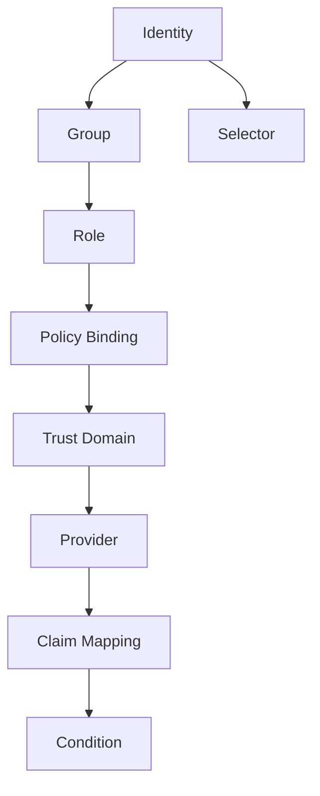
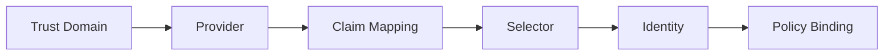
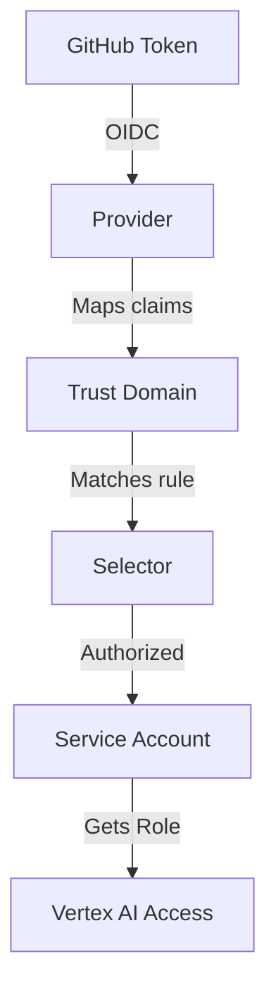

> Modern cloud IAM systems—like Google Cloud IAM—are marvels of power, precision, and policy granularity. Yet, they also carry a legacy of complexity.

## How We Rediscovered Simplicity in a Sea of Complexity

Concepts like *principals*, *principalSets*, *workload identity pools*, and *attribute mappings* are internally consistent—but mentally exhausting for the average developer.

This is the story of how we stepped back, re-examined IAM from first principles, and reimagined the experience to be as clear as plain English.

Our goal? **To make authentication and authorization readable, learnable, and lovable.**

---

## The Cognitive Load Problem

Every cloud developer has seen (and feared) commands like this:

```bash
gcloud iam service-accounts add-iam-policy-binding "$SA_EMAIL" \
  --project "$PROJECT_ID" \
  --role "roles/iam.workloadIdentityUser" \
  --member "principalSet://iam.googleapis.com/projects/${PROJECT_NUMBER}/locations/global/workloadIdentityPools/github/attribute.repository/shipfail/firegen" \
  --condition="expression=attribute.ref=='refs/heads/main'"
```

### 😵 What’s wrong here?

- Too many nested layers (`projects/.../pools/.../attributes/...`)
- Unclear nouns (*principalSet*? *ref*?)
- Inconsistent mix of command words and variable data

#### 🧠 Cognitive Load Diagram

```text
User goal → Add IAM policy binding
           ↳ Needs to know 8+ sub-concepts
             ↳ PrincipalSet → Pool → Provider → Attribute → Ref → Repo → Expression
```

We realized that the complexity wasn’t in the concept—it was in the **language**.

---

## Thinking from First Principles

Before naming anything, we asked one question:

> What are the absolute primitives of an identity system?

We concluded there are only a few:



Each concept builds on the previous one, forming a simple, human-readable hierarchy.

---

## Why “Principal” Was the Wrong Abstraction

Google’s IAM defines a **principal** as *“an entity whose identity can be authenticated and authorized.”*

Technically correct—but conceptually distant.

Developers already understand the idea of a **user**, **service account**, and **group**. The word *principal* adds no clarity; it adds translation overhead.

Worse, Google’s *principalSet* is a mathematical way of saying “a set of identities that match certain attributes.”

We don’t think in sets. We think in selectors.

---

## Enter the Plain-English Model

Here’s our redesigned naming system:

| Google Cloud IAM Term          | Plain-English Redesign              | Meaning                                       |
| ------------------------------ | ----------------------------------- | --------------------------------------------- |
| Principal                      | **Identity**                        | A human or service that can authenticate      |
| principalSet                   | **Selector**                        | A rule-based group of identities              |
| Workload Identity Pool         | **Trust Domain**                    | The source of external identities             |
| OIDC/SAML Provider             | **Provider**                        | The validation mechanism for a domain         |
| Attribute Mapping              | **Claim Mapping**                   | Maps token claims → IAM attributes            |
| Condition                      | **Condition**                       | Boolean rule for context (unchanged)          |
| Role Binding                   | **Policy Binding**                  | The relationship between role & identity      |
| roles/iam.workloadIdentityUser | **roles/iam.federatedImpersonator** | Grants external identity impersonation rights |

Readable, intuitive, universal.

---

## Designing a CLI for Humans

### The Core Rule: **Separate Syntax from Semantics**

In Google’s `gcloud`, user-supplied variables mix with fixed command syntax. That’s cognitively expensive.

We designed a rule called **Visual Semantic Separation**:

> Every user-provided value must appear as a named `--param` flag. No hidden positionals, no guessing.

---

### 🧩 Old vs. New Comparison

| Action          | Google Cloud (Today)                                                                                                                                                         | New IAM (Redesigned)                                                                                                                                                                     |
| --------------- | ---------------------------------------------------------------------------------------------------------------------------------------------------------------------------- | ---------------------------------------------------------------------------------------------------------------------------------------------------------------------------------------- |
| Add IAM Binding | `gcloud iam service-accounts add-iam-policy-binding "$SA_EMAIL" --role "roles/iam.workloadIdentityUser" --member "principalSet://.../attribute.repository/shipfail/firegen"` | `iam identity grant --account "$SA_EMAIL" --role roles/iam.federatedImpersonator --to selector://repo=shipfail/firegen,branch=main`                                                      |
| Create Pool     | `gcloud iam workload-identity-pools create github`                                                                                                                           | `iam trust-domain create --name github --display-name "GitHub Actions"`                                                                                                                  |
| Add Provider    | `gcloud iam workload-identity-pools providers create-oidc github`                                                                                                            | `iam provider add --domain github --name actions --issuer https://token.actions.githubusercontent.com --claim-mapping repo=assertion.repository,ref=assertion.ref,actor=assertion.actor` |
| Create Selector | `gcloud iam workload-identity-pools attributes create`                                                                                                                       | `iam selector create --name repo-shipfail-firegen-main --expr "repo == 'shipfail/firegen' && ref == 'refs/heads/main'"`                                                                  |

### Visual Flow of the New Model



This reads like natural English:

> Trust domain defines where identities come from → Provider validates tokens → Selector filters them → Identities receive roles.

---

## The New Command-Line Philosophy

| Principle               | Rule                                   | Example                                      |
| ----------------------- | -------------------------------------- | -------------------------------------------- |
| **No positionals**      | Every value is explicitly named        | `--project`, `--role`, `--account`           |
| **Clear rhythm**        | Commands are `noun verb --param value` | `iam identity grant --role viewer`           |
| **Uniform join syntax** | `=` for literals, space for variables  | `--role=viewer`, `--account "$ACCOUNT"`      |
| **No nested paths**     | Replace URIs with semantic selectors   | `selector://repo=shipfail/firegen`           |
| **Consistent nouns**    | Commands start with an entity name     | `iam identity create`, `iam selector define` |

---

## Our Design Principles: The Philosophy of Human-Centered IAM

1. **Plain Language First** — Use natural words that describe intent (trust-domain, selector, identity).
2. **Visual Consistency** — Every flag/value pair looks the same; user inputs always have `--` prefixes.
3. **Predictable Grammar** — Commands read like English sentences: `iam identity grant --role admin`.
4. **Composable by Design** — Trust domains, providers, and selectors fit like Lego blocks.
5. **No Hidden Context** — Every action is explicit; no positional magic.
6. **Readable by Humans, Executable by Machines** — The command should teach by itself.
7. **Reduce Cognitive Jumps** — From intent to syntax, one thought equals one command.

---

## Example Workflow

### 1️⃣ Create a trust domain for GitHub

```bash
iam trust-domain create --name github --display-name "GitHub Actions"
```

### 2️⃣ Add a provider

```bash
iam provider add --domain github --name actions \
  --issuer https://token.actions.githubusercontent.com \
  --claim-mapping repo=assertion.repository,ref=assertion.ref,actor=assertion.actor
```

### 3️⃣ Define a selector for one repo + branch

```bash
iam selector create --name repo-shipfail-firegen-main \
  --expr "repo == 'shipfail/firegen' && ref == 'refs/heads/main'"
```

### 4️⃣ Grant impersonation

```bash
iam identity grant \
  --account gha-vertex@cineai.iam.gserviceaccount.com \
  --role roles/iam.federatedImpersonator \
  --to selector://repo-shipfail-firegen-main
```

#### Visual Summary



Readable. Predictable. Teachable.

---

## Mapping Old to New

| Old GCP Concept                                      | New Concept                       | Example                |
| ---------------------------------------------------- | --------------------------------- | ---------------------- |
| `principalSet://.../attribute.repository/OWNER/REPO` | `selector://repo=OWNER/REPO`      | Easier and declarative |
| `attribute.ref=='refs/heads/main'`                   | `branch=main`                     | Plain, natural         |
| `workloadIdentityPools.create`                       | `trust-domain create`             | Self-descriptive       |
| `providers.create-oidc`                              | `provider add`                    | Simpler verbs          |
| `roles/iam.workloadIdentityUser`                     | `roles/iam.federatedImpersonator` | Semantic clarity       |

---

## Why This Matters

### For developers

- Clear mental model → faster learning curve
- Commands read like instructions, not incantations
- Consistent syntax across all IAM actions

### For architects

- Easier to reason about trust boundaries
- Policy design is composable and auditable
- Reduced risk of misconfiguration

### For platform teams

- Lower onboarding friction
- Uniform automation interfaces
- Documentation that actually teaches

---

## Closing Thoughts: When Language Shapes Thinking

Every tool is also a language.\
And every language shapes how we think.

The current Google Cloud IAM syntax reflects an era of **machine-first precision**.\
Our redesign aims for **human-first clarity**—without sacrificing correctness.

When the concepts match intuition, the mental load drops, the speed rises, and the joy returns.

> The cloud should not demand fluency in bureaucracy.\
> It should speak in plain, powerful English.

---

## 🚀 Call to Action: Join the Rethink

If this vision resonates with you—whether you’re a developer, architect, or product designer—join us in the conversation.\
Share your feedback, your pain points, and your ideas for making developer tools as elegant as their underlying systems.

👉 **Tag your reflections with** `linkedin` **or** `twitter`, and let’s build a new language of clarity together.
