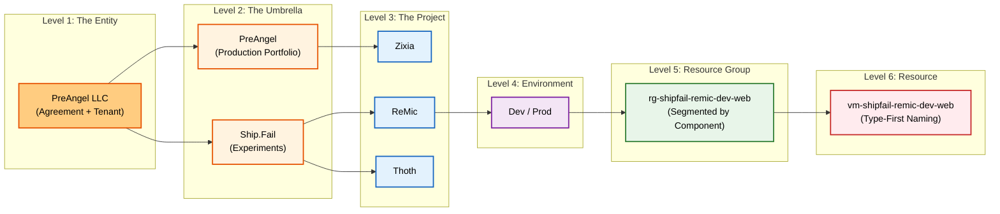

> **TL;DR:** I used to dread opening my Azure portal—it was a graveyard of forgotten resources and confusing bills. Today, it’s a clean machine that matches exactly how I run my business. Here is the 'Unified Tree' naming playbook I used to turn chaos into clarity, so you can steal it for your own cloud.

## 0. Context: Part 3 of a Small Trilogy

In my [first post](/ideas/2025/11/04/rethinking-azure-billing/), I redesigned the way I *think* about cloud billing. I started with a "Two Tree" model: one for Money (Finance) and one for Work (Ops).

In the [second post](/tools/2025/11/25/the-antigravity-effect-when-coding-becomes-orchestration/), I locked in how I *ship*: a "Vibe Coding" workflow where AI orchestration handles the heavy lifting, and every Project has exactly two environments—`dev` for fast iteration and `prod` for deliberate releases.

But as I sat down to actually name my resources in Azure, I realized something crucial for a solo founder or small team: **The Two Trees are actually one.**

I don't have a separate Finance department fighting with Engineering. I am both. The "Legal Entity" paying the bill is the same "Organization" managing the tenant. The "Cost Center" is the same as the "Portfolio".

So, I simplified the model even further. This post is the result: **The Unified Tree Playbook**.

---

## 1. The Blueprint: The Unified Tree

Instead of juggling a "Finance View" and an "Ops View," we merge them into a single vertical line. This is the only hierarchy you need to keep in your head.



My goal was simple: **Every name in my cloud must map directly to a node on this chart.**

---

## 2. Design Constraints From My Brain

Before touching any names, I wrote down the constraints that matter to **me**:

1.  **One company, one tree.**
    I’m a local US company: **PreAngel LLC**. Because I am one company, Finance and Ops are the same tree. I don't need to track "Internal Cross-Charging."

2.  **Three umbrellas, not fifty cost centers.**
    I spend money in three big contexts, which are also my three big portfolios:
    *   **PreAngel** – real production products.
    *   **ShipFail** – hackathon ideas and MVP experiments.
    *   **ToBeMigrated** – old things I haven’t cleaned up yet.

3.  **Named Projects, not random subscriptions.**
    I don’t want to think "sub-9a12f3…". I want to think:
    *   **Zixia** – a product under the **PreAngel** umbrella.
    *   **Thoth** – an experiment under **ShipFail**.
    *   **ReMic** – another experiment under **ShipFail**.

4.  **Exactly two environments per Project.**
    *   `dev` – every merge to `main` deploys here.
    *   `prod` – only deliberate promotions land here.

5.  **Names must explain themselves.**
    If future-me can’t decode a name in under three seconds, it’s a bad name.

---

## 3. Mapping Once, Then Forgetting: The Cheat Sheet

This is the only place in this post where I will mention the old Azure terms directly. Everywhere else, I only use my own vocabulary.

| Level | My Name | What it means in my head | Azure Term (Reference Only) |
| :--- | :--- | :--- | :--- |
| **1** | **The Entity** | PreAngel LLC (The Root) | Billing Account + Tenant |
| **2** | **The Umbrella** | A Context Bucket (ShipFail, PreAngel) | Invoice Section |
| **3** | **The Project** | A Named Workload (Zixia, ReMic) | Subscription |
| **4** | **Environment** | `dev` or `prod` | (Naming Pattern / Tag) |
| **5** | **Resource Group** | A logical segment (web, api, data) | Resource Group |
| **6** | **Resource** | The actual thing (VM, DB) | Resource |

That’s it. After this table, I no longer say "subscription" or "invoice section" in my daily thinking. I say: *"Umbrella **ShipFail**, Project **ReMic**, `dev` environment, `web` Resource Group."*

---

## 4. Naming Conventions, Layer by Layer

I designed my naming system to satisfy three main goals:
1.  **Type first:** Sort similar things together (all VMs, all DBs).
2.  **Context visible:** Answer "who pays?" and "what project?" instantly.
3.  **Environment explicit:** Never mistake `dev` for `prod`.

### 4.1 Umbrella
Umbrellas are mostly a tagging concept, but I use a canonical string for each:
*   `umb-preangel`
*   `umb-shipfail`
*   `umb-tobemigrated`

### 4.2 Project
Projects are the atomic unit of the Unified Tree. Their names are explicit:
`prj-<umbrella>-<project>`

*   `prj-preangel-zixia`
*   `prj-shipfail-thoth`
*   `prj-shipfail-remic`

When I see `prj-shipfail-remic`, my brain instantly decodes: *This is the **ReMic** Project, under the **ShipFail** umbrella.*

### 4.3 Resource Groups
Resource Groups are the backbone of my structure. They encode **Umbrella**, **Project**, **Environment**, and optionally a **Segment**.

`rg-<umbrella>-<project>-<env>-<segment?>`

*   `rg-shipfail-remic-dev-web`
*   `rg-shipfail-remic-prod-api`
*   `rg-preangel-zixia-prod-data`

### 4.4 Resources
Resources follow a "type-first" convention. The name starts with a short type code, then echoes the same structure:

`<shorttype>-<umbrella>-<project>-<env>-<segment?>`

*   `vm-shipfail-remic-dev-web` (A dev web VM for ReMic)
*   `st-shipfail-thoth-dev-data` (A dev storage account for Thoth)
*   `fn-preangel-zixia-prod-web` (A prod web function for Zixia)

---

## 5. Walking Through a Real Example: ShipFail / ReMic

Let’s put everything together and see how a real Project looks in practice. Because we have a Unified Tree, we don't need separate "Money" and "Work" diagrams. It's all one view.

### The Unified View 🌳

```text
Entity: PreAngel LLC
└─ Umbrella: ShipFail
     └─ Project: prj-shipfail-remic
          ├─ Environment: dev
          │    ├─ Resource Group: rg-shipfail-remic-dev-web
          │    │     ├─ vm-shipfail-remic-dev-web
          │    │     └─ st-shipfail-remic-dev-web
          │    └─ Resource Group: rg-shipfail-remic-dev-api
          │          └─ fn-shipfail-remic-dev-api
          └─ Environment: prod
               ├─ Resource Group: rg-shipfail-remic-prod-web
               │     └─ vm-shipfail-remic-prod-web
               └─ Resource Group: rg-shipfail-remic-prod-api
                     └─ db-shipfail-remic-prod-api
```

Every box in that tree has a name that tells the same story. Future-me can open any of those names in the cloud console and instantly know:
1.  This belongs to **ShipFail** (Context/Budget).
2.  Specifically to the **ReMic** Project (Workload).
3.  In the **dev** or **prod** environment (Stage).
4.  And in the **web** or **api** segment (Component).

---

## 6. Tags: The Labels That Save You at 2 AM

Names are great for humans, but tags are where the real power comes from—for search, billing dashboards, and future automation.

I keep my tag schema small and strict. **Crucially, I removed the `Org` tag.** Since everything is in PreAngel LLC, tagging it `Org=PreAngel` is just noise.

```text
Umbrella  = PreAngel | ShipFail | ToBeMigrated
Project   = Zixia | Thoth | ReMic | ...
Env       = dev | prod
Segment   = web | api | data | tools | ...
```

Every **Resource Group** and every important **Resource** must have all of these tags.

**Example: A prod API database for Zixia**
*   **Name:** `db-preangel-zixia-prod-api`
*   **Tags:**
    *   `Umbrella = PreAngel`
    *   `Project = Zixia`
    *   `Env = prod`
    *   `Segment = api`

Now I can answer questions like *"How much am I spending on **dev** environments?"* or *"Show me everything in **ShipFail**"* with a simple filter.

---

## 7. The "KonMari" Checklist for Your Cloud

Here’s the practical checklist I used when I sat down to clean up my Azure resources. You can literally copy-paste this into your own notebook.

1.  **Decide the Umbrellas:** I committed to exactly three (`PreAngel`, `ShipFail`, `ToBeMigrated`).
2.  **List your Projects:** Under each Umbrella, list the concrete Projects (e.g., `Zixia`, `Thoth`).
3.  **Rename Projects:** Rename the Project object (Subscription) to `prj-<umbrella>-<project>`.
4.  **Create Resource Groups:** Create RGs for `dev` and `prod` following `rg-<umbrella>-<project>-<env>-<segment?>`.
5.  **Move Resources:** Move existing resources into the new RGs. If a resource sparks confusion ("why is this here?"), delete it or move it to `ToBeMigrated`.
6.  **Apply Tags:** Tag everything. No exceptions.

---

## 8. Why This Matters

This might look like a naming problem, but for me, it’s really about **cognitive load**.

When the portal matches my mental model, I make fewer mistakes. When `dev` vs `prod` is encoded into names and tags, I’m less likely to destroy something important at 2 AM.

If you’re also a solo founder, hacker, or small team juggling multiple ideas, I hope this playbook helps you design a cloud that feels like it belongs to you, instead of the other way around.

**Steal this system.** You don't have to use my names (`ShipFail`, `Zixia`), but the **shape**—The Unified Tree—will save your sanity.
