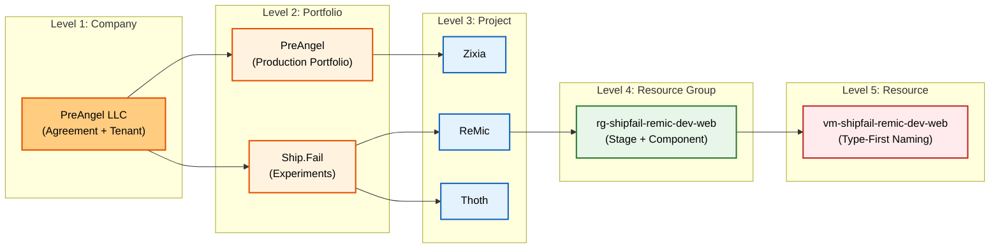

> **The Promise:** By the end of this post, you will have a blueprint to turn your Azure portal from a terrifying graveyard of forgotten VMs into a sleek, predictable machine that mirrors your brain.

## 0. The "Cloud Anxiety" Is Real

We’ve all been there. You log into the Azure portal to check on a quick experiment you ran three months ago.

Suddenly, you see it.

A resource group named `Default-Web-WestUS`. A storage account named `mystorage123`. A bill that is $50 higher than you expected because of a "Zombie VM" you swore you deleted.

For a solo founder or a one-person startup incubator, this isn't just messy—it's **cognitive debt**. Every time you have to pause and ask *"Wait, what is this resource?"*, you are leaking the mental energy you should be using to build your product.

I was drowning in this chaos. I needed a way out.

This post is Part 3 of my journey to fix it.

* **Part 1:** [Rethinking Azure Billing](/2025/11/04/rethinking-azure-billing/) (The Theory)
* **Part 2:** [Vibe Coding to Production: The Case for a Two-Stage Pipeline](/2025/10/13/two-stage-deployment-playbook/) (The Workflow)
* **Part 3 (This Post):** The Execution.

Here is the **Ship.Fail Protocol**: the exact naming and tagging system I use to run my entire cloud empire of one.

---

## 1. The Epiphany: The "Unified Tree"

In my earlier drafts, I tried to be clever. I designed a "Two Tree" model: one hierarchy for **Money** (Finance) and another for **Work** (Ops).

It sounded smart on paper. In reality, it was a disaster.

As a solo founder, I don't have a Finance Department fighting with an Engineering Department. **I am both.** The entity paying the bill is the same entity writing the code.

So I collapsed the complexity. I realized that for us—the builders, the hackers, the solo founders—**the two trees are actually one.**

We don't need a "Finance View" and an "Ops View." We need a **Unified Tree**. A single vertical line that connects the credit card to the code.

(In earlier posts, I called these top-level buckets **Umbrellas**. In this post, I’ll call them **Portfolios**. Same idea, slightly nicer word.)

---

## 2. The Blueprint: One Hierarchy to Rule Them All

This is the only mental model you need to keep in your head. If a resource doesn't fit on this chart, **it doesn't exist.**



### The 5 Levels of Sanity

1. **Company:** Who pays? (PreAngel LLC)
2. **Portfolio:** What is the *context*? (Ship.Fail for experiments, PreAngel for serious products)
3. **Project:** What is the *workload*? (Zixia, ReMic, Thoth)
4. **Resource Group:** The container (Stage + Component).
   * **Stage:** `dev` (continuous deployment) vs `prod` (hand-picked versions).
5. **Resource:** The actual VM, Database, or Function.

---

## 3. The Translation Layer (Or: How to Ignore Microsoft's Jargon)

Azure's billing and management terminology is designed for Fortune 500 enterprises with 10,000 employees. It is overkill for us.

I created a "Translation Layer" to map their complex terms to my simple reality.

| Level | My Name            | What it means to ME                                                                                                                                                                             | Azure Term (Reference Only)                                                                      |
| ----- | ------------------ | ----------------------------------------------------------------------------------------------------------------------------------------------------------------------------------------------- | ------------------------------------------------------------------------------------------------ |
| **1** | **Company**        | My company (the root that owns the credit card and the tenant).                                                                                                                                 | Billing account + tenant                                                                         |
| **2** | **Portfolio**      | A context bucket: PreAngel (production), Ship.Fail (experiments), ToBeMigrated (legacy parking lot).                                                                                            | Invoice section                                                                                  |
| **3** | **Project**        | A named workload like Zixia, Thoth, ReMic. In PreAngel: maps 1:1 to an Azure (subscription). In Ship.Fail: implemented as a family of Resource Groups inside a shared lab Azure (subscription). | Azure subscription (PreAngel) / Resource Group family in a shared Azure subscription (Ship.Fail) |
| **4** | **Resource Group** | A logical container for a specific Stage (`dev`/`prod`) and Component (`web`/`api`).                                                                                                            | Resource group                                                                                   |
| **5** | **Resource**       | The actual thing: VM, DB, storage account, function, key vault, etc.                                                                                                                            | Resource                                                                                         |

**The Golden Rule:** After this table, I almost never say "subscription" out loud. I speak in **Portfolios** and **Projects**, and only mention Azure terms in parentheses when I really need to.

### Stage Is Virtual (But Critical)

Stage (`dev` / `prod`) is not a separate level in the hierarchy, but it is a critical dimension of the **Resource Group**.

* **dev**: Deploys continuously from Git commits.
* **prod**: Deploys only hand-picked versions.

This is why the Unified Tree merges Stage into the Resource Group level.

### Same Tree, Two Implementations (Ship.Fail vs PreAngel)

Here’s the twist that makes everything click:

The **Unified Tree** is always the same in my head:

> Company → Portfolio → Project → Resource Group (Stage + Component) → Resource

But it is **implemented differently** for my two main portfolios:

* **PreAngel (Production Portfolio)**

  * **Project = Azure (subscription).**
  * Each serious product (like Zixia) gets its own Project at the subscription level.
  * Inside that, I create Resource Groups for `dev` and `prod` plus components (`web`, `api`, `data`, ...).
* **Ship.Fail (Experiment Portfolio)**

  * Everything is **leveled down by one notch** to keep life simple.
  * Ship.Fail uses **one shared lab Azure (subscription)**.
  * Each Project (Thoth, ReMic, etc.) lives as **a family of Resource Groups**, not its own subscription.

You can visualize it like this:

```text
PreAngel (Production)
  Company → Portfolio → Project → Resource Group (w/Stage) → Resource
                        ^
                        |
                 Azure (subscription)

Ship.Fail (Experiments)
  Company → Portfolio → Project → Resource Group (w/Stage) → Resource
                  ^              ^
                  |              |
         Azure (subscription)   Project implemented as a Resource Group family
```

Same tree. Same words. Different physical layer where the Project lives.

And this leads to one of my favourite properties of this system: **Projects can graduate.**

When a Ship.Fail project becomes a “real” product:

* In Ship.Fail, it starts life as:

  * one entry in my Projects list (e.g., `ReMic`), and
  * a set of Resource Groups like `rg-shipfail-remic-dev-web`, `rg-shipfail-remic-prod-api` inside the shared lab subscription.
* When it “graduates” to PreAngel, I **move it up one layer**:

  * I create a new production Project at the subscription layer (e.g., `prj-preangel-remic` as an Azure subscription name), and
  * I recreate its Resource Groups following the same pattern but under the PreAngel portfolio (e.g., `rg-preangel-remic-dev-web`, `rg-preangel-remic-prod-web`).

The names barely change—mostly `shipfail` → `preangel`—but the Project moves from “lab” mode to “production” mode.

---

## 4. The Naming Playbook: Rules for the Road

A naming convention is useless if you have to look it up every time. It needs to be intuitive. Here is the **Ship.Fail Protocol**.

### Rule #1: The Portfolio

I have exactly three Portfolios (contexts). No more, no less.

* `pf-preangel` (Real products making money)
* `pf-shipfail` (Hackathons, MVPs, crazy ideas)
* `pf-tobemigrated` (The "Box of Shame" for old stuff)

### Rule #2: The Project

Projects are the atomic unit in my head. They are named explicitly:

```text
prj-<portfolio>-<project>
```

Examples:

* `prj-preangel-zixia`
* `prj-shipfail-thoth`
* `prj-shipfail-remic`

How this plays out in practice:

* In **PreAngel**, `prj-preangel-zixia` is both:

  * the conceptual Project name, and
  * the name I give to its dedicated Azure (subscription).
* In **Ship.Fail**, `prj-shipfail-remic` is still the conceptual Project name, but:

  * all Ship.Fail Projects share a single lab Azure (subscription), and
  * the Project is implemented as a **family of Resource Groups and tags** with the `shipfail-remic` pattern.

**Why this works:** When I see `prj-shipfail-thoth`, I know instantly: *This is an experiment (Ship.Fail) called Thoth.* Whether it currently lives as its own subscription (PreAngel style) or as Resource Groups inside the lab subscription (Ship.Fail style) is an implementation detail I can always look up—but the name and tags tell the story.

### Rule #3: The Resource Group (The Backbone)

This is where the magic happens. The Resource Group name encodes the entire lineage of the resource.

```text
rg-<portfolio>-<project>-<stage>-<component?>
```

Examples:

* `rg-shipfail-remic-dev-web`
* `rg-preangel-zixia-prod-data`

Under Ship.Fail, this is also how Projects show up structurally:

* `rg-shipfail-remic-dev-web`, `rg-shipfail-remic-dev-api`, `rg-shipfail-remic-prod-web`, ...
* All of them live inside the **same Ship.Fail lab subscription**, but their names and tags still encode Portfolio, Project, Stage, and Component.

**The "3-Second Rule":** If I can't tell you exactly what a Resource Group contains and who pays for it within 3 seconds of reading the name, **it is a bad name.**

### Rule #4: The Resource (Type-First)

I use type‑first naming. Start with the resource type abbreviation, then echo the hierarchy.

```text
<shorttype>-<portfolio>-<project>-<stage>-<component?>
```

Examples:

* `vm-shipfail-remic-dev-web` (A VM)
* `st-shipfail-thoth-dev-data` (A Storage Account)
* `fn-preangel-zixia-prod-web` (A Function App)
* `db-preangel-zixia-prod-api` (A Database)

Type-first gives me a nice property when I sort by name:

* all `vm-*` resources group together,
* all `db-*` resources group together,
* and my eyes can skim quickly.

### A Before → After Rename Example

Here’s how this looks in practice on a messy real-world example.

**Before:**

* Resource Group: `Default-Web-WestUS`
* Storage Account: `mystorage123`

Three months later, I have *no idea* what either of those are.

**After:**

```text
Resource Group: rg-shipfail-remic-dev-web
Storage Account: st-shipfail-remic-dev-web
Tags:
  Portfolio = ShipFail
  Project   = ReMic
  Stage     = dev
  Component = web
```

Now the same pair of resources tells me, at a glance:

* this is part of the **ReMic** Project,
* under the **Ship.Fail** portfolio,
* in the **dev** stage,
* in the **web** component.

I don’t need a wiki, a spreadsheet, or a memory palace. The name *is* the documentation.

---

## 5. Do I Need Separate VNets for Every Project?

One important constraint from the cloud world: a virtual network (VNet) lives inside **one** Azure (subscription). It can be peered to others, but it cannot be “shared” across subscriptions without extra setup.

Instead of fighting this, I embraced it in the design:

* **Ship.Fail (experiments):**

  * Uses **one shared lab subscription** for all experiments.
  * Inside it, I create **one VNet per region**, like:

    * `vnet-shipfail-wus3`
  * Then I carve subnets for stages:

    * `snet-shipfail-dev-default`
    * `snet-shipfail-prod-default`
  * All Projects under Ship.Fail (Thoth, ReMic, etc.) reuse this same VNet and its subnets.

* **PreAngel (production):**

  * Each production Project usually gets its **own** VNet inside its own subscription, like:

    * `vnet-preangel-zixia-wus3`
  * This keeps blast radius small and makes it easy to reason about production networking per product.

The names still follow the same structure, but Ship.Fail intentionally optimizes for **convenience and reuse**, while PreAngel optimizes for **isolation and long-term clarity**.

---

## 6. Seeing It In Action

Let’s walk through a real example. Imagine I am building a new AI tool called **ReMic** under my **Ship.Fail** incubator.

### 6.1 ReMic as a Ship.Fail Project (Lab Mode)

Here is what my cloud looks like in the Ship.Fail lab subscription:

```text
Company: PreAngel LLC
└─ Portfolio: ShipFail
     └─ Project: ReMic (conceptually: prj-shipfail-remic)
          ├─ Resource Group: rg-shipfail-remic-dev-web
          │     ├─ vm-shipfail-remic-dev-web
          │     └─ st-shipfail-remic-dev-web
          ├─ Resource Group: rg-shipfail-remic-dev-api
          │     └─ fn-shipfail-remic-dev-api
          ├─ Resource Group: rg-shipfail-remic-prod-web
          │     └─ vm-shipfail-remic-prod-web
          └─ Resource Group: rg-shipfail-remic-prod-api
                └─ db-shipfail-remic-prod-api
```

All of these live inside the same Ship.Fail lab Azure (subscription), reuse the same VNet (`vnet-shipfail-wus3`), and are separated by tags and naming only.

Future-me can open any of those names in the cloud console and instantly know:

1. **Portfolio:** It's a Ship.Fail experiment.
2. **Project:** It's for ReMic.
3. **Stage:** It's `dev` (continuous deployment) or `prod` (hand-picked versions).
4. **Component:** It's the `web` or `api` layer.

### 6.2 ReMic Graduates to PreAngel (Production Mode)

Now suppose ReMic proves itself and deserves to become a serious product.

I don’t throw away the tree; I simply **move it up one level**:

* I create a new production Project under the PreAngel portfolio, implemented as its own Azure (subscription):

  * `prj-preangel-remic`
* Inside that subscription, I recreate the Resource Groups with the same pattern:

```text
Company: PreAngel LLC
└─ Portfolio: PreAngel
     └─ Project: prj-preangel-remic
          ├─ Resource Group: rg-preangel-remic-dev-web
          ├─ Resource Group: rg-preangel-remic-prod-web
          └─ Resource Group: rg-preangel-remic-prod-api
```

* ReMic now gets its own dedicated VNet, e.g. `vnet-preangel-remic-wus3`.
* I can migrate or redeploy workloads from the Ship.Fail lab into this new home.

In practice, “graduation” often means **redeploying infrastructure using IaC** (Terraform, Bicep, ARM) into the new subscription, rather than literally clicking "Move" on every resource. But the naming and tagging stay the same, so the promotion feels natural.

The mental model is the same. The only changes are:

* `Portfolio` value: from `ShipFail` → `PreAngel`.
* Physical level where the Project lives: from Resource Group family inside a shared subscription → its own subscription.

That’s how graduation works in this protocol.

### 6.3 Zixia as a PreAngel Project (Always Production-First)

The **PreAngel** portfolio is where my “serious” products live. Zixia is one of them.

```text
Company: PreAngel LLC
└─ Portfolio: PreAngel
     └─ Project: prj-preangel-zixia
          ├─ Resource Group: rg-preangel-zixia-dev-web
          │     └─ fn-preangel-zixia-dev-web
          └─ Resource Group: rg-preangel-zixia-prod-web
                └─ fn-preangel-zixia-prod-web
```

Its tags might look like this:

```text
Portfolio = PreAngel
Project   = Zixia
Stage     = dev / prod
Component = web
```

Once again, future-me doesn’t have to remember anything. The information is written directly into the names and tags.

---

## 7. Tags: The "KonMari" of the Cloud

Names are for humans. Tags are for robots (and billing dashboards).

I stripped my tagging strategy down to the bare essentials. I removed the `Org` tag because *everything* is PreAngel LLC. Why tag the obvious?

**The Essential Tag Set:**

```text
Portfolio = PreAngel | ShipFail | ToBeMigrated
Project   = Zixia | Thoth | ReMic | ...
Stage     = dev | prod
Component = web | api | data | tools | ...
```

**Example:** A production database for Zixia.

* **Name:** `db-preangel-zixia-prod-api`
* **Tags:** `Portfolio=PreAngel`, `Project=Zixia`, `Stage=prod`, `Component=api`

Now, when I want to know *"How much am I spending on all my `dev` stages combined?"*, it is a single filter away.

---

## 8. How Do I Actually Start Cleaning This Up Tomorrow?

Ready to turn your graveyard into a machine? Here is the exact checklist I used. Steal it.

1. **Define Your Portfolios.**
   Commit to 2–3 high-level contexts. (For me: `PreAngel`, `ShipFail`, `ToBeMigrated`.)

2. **Decide Implementation Per Portfolio.**

   * For your “serious” portfolio (like PreAngel), let each Project be its own Azure (subscription).
   * For your “lab” portfolio (like Ship.Fail), pick one shared lab Azure (subscription) and implement Projects as families of Resource Groups inside it.

3. **Inventory Your Projects.**
   List every Project you care about today and give it a clear name: `prj-<portfolio>-<project>`.

4. **Create the Containers.**
   For each Project:

   * In PreAngel-style portfolios: create or rename the Azure (subscription) accordingly, then create Resource Groups using the `rg-...` pattern.
   * In Ship.Fail-style portfolios: create Resource Groups directly in the lab subscription using the `rg-...` pattern.

5. **The Great Migration.**
   Move resources into their new homes. If something doesn’t obviously belong to a Project and Stage, that’s a red flag.

6. **The Purge.**
   If you find a resource that doesn't fit into your new tree... **delete it.** If you can't name it, you don't need it.

7. **Tag Everything.**
   No exceptions. Portfolio, Project, Stage, Component.

If you only have 30 minutes, pick **one** Project (for me, it was ReMic), apply the naming + tags + VNet model just to that, and stop. Even that small slice of clarity feels shockingly good.

---

## 9. Final Thought: Cognitive Freedom for a Company of One

This might look like a post about naming conventions. It’s not.

**It is a post about cognitive freedom.**

When your cloud environment matches your mental model, the friction disappears. You stop worrying about "phantom costs" and "zombie VMs." You stop hesitating before you deploy.

For a company of one, your cloud is more than infrastructure. It’s an exoskeleton for your brain. If it’s noisy and confusing, it drags you down. If it’s clean and aligned with how you think, it amplifies you.

So go ahead. Steal this protocol. Rename your world. Let your experiments live in Ship.Fail, let your winners graduate to PreAngel, and get back to shipping.
