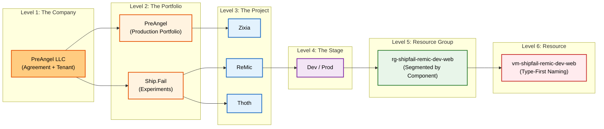

> **The Promise:** By the end of this post, you will have a blueprint to turn your Azure portal from a terrifying graveyard of forgotten VMs into a sleek, predictable machine that mirrors your brain.

## 0. The "Cloud Anxiety" Is Real

We’ve all been there. You log into the Azure portal to check on a quick experiment you ran three months ago.

Suddenly, you see it.

A resource group named `Default-Web-WestUS`. A storage account named `mystorage123`. A bill that is $50 higher than you expected because of a "Zombie VM" you swore you deleted.

For a solo founder or a one-person startup incubator, this isn't just messy—it's **cognitive debt**. Every time you have to pause and ask *"Wait, what is this resource?"*, you are leaking the mental energy you should be using to build your product.

I was drowning in this chaos. I needed a way out.

This post is Part 3 of my journey to fix it.

* **Part 1:** [Rethinking Azure Billing](/2025/11/04/rethinking-azure-billing/) (The Theory)
* **Part 2:** [Vibe Coding to Production: The Case for a Two-Stage Pipeline](/2025/10/13/two-stage-deployment-playbook/) (The Workflow)
* **Part 3 (This Post):** The Execution.

Here is the **Ship.Fail Protocol**: The exact naming and tagging system I use to run my entire cloud empire of one.

---

## 1. The Epiphany: The "Unified Tree"

In my earlier drafts, I tried to be clever. I designed a "Two Tree" model: one hierarchy for **Money** (Finance) and another for **Work** (Ops).

It sounded smart on paper. In reality, it was a disaster.

As a solo founder, I don't have a Finance Department fighting with an Engineering Department. **I am both.** The entity paying the bill is the same entity writing the code.

So I collapsed the complexity. I realized that for us—the builders, the hackers, the solo founders—**The Two Trees are actually one.**

We don't need a "Finance View" and an "Ops View." We need a **Unified Tree**. A single vertical line that connects the credit card to the code.

---

## 2. The Blueprint: One Hierarchy to Rule Them All

This is the only mental model you need to keep in your head. If a resource doesn't fit on this chart, **it doesn't exist.**



### The 6 Levels of Sanity

1.  **The Company:** Who pays? (PreAngel LLC)
2.  **The Portfolio:** What is the *context*? (Ship.Fail for experiments, PreAngel for serious products)
3. **The Project:** What is the *workload*? (Zixia, ReMic, Thoth)
4. **The Stage:** Is this safe to break? (`dev` vs `prod`)
5. **The Resource Group:** The logical container.
6. **The Resource:** The actual VM, Database, or Function.

---

## 3. The Translation Layer (Or: How to Ignore Microsoft's Jargon)

Microsoft’s naming (Management Groups, Subscriptions, Invoice Sections) is designed for Fortune 500 enterprises with 10,000 employees. It is overkill for us.

I created a "Translation Layer" to map their complex terms to my simple reality.

| Level | My Name | What it means to ME | Azure Term (Reference Only) |
| :--- | :--- | :--- | :--- |
| **1** | **The Company** | My Company (The Root) | Billing Account + Tenant |
| **2** | **The Portfolio** | A Context Bucket | Invoice Section |
| **3** | **The Project** | A Named Workload | Subscription |
| **4** | **The Stage** | `dev` or `prod` | (Naming Pattern / Tag) |
| **5** | **Resource Group** | A logical segment | Resource Group |
| **6** | **Resource** | The actual thing | Resource |

**The Golden Rule:** After this table, I never use the word "Subscription" again. I only speak in **Projects**.

---

## 4. The Naming Playbook: Rules for the Road

A naming convention is useless if you have to look it up every time. It needs to be intuitive. Here is the **Ship.Fail Naming Standard**.

### Rule #1: The Portfolio

I have exactly three "Portfolios" (Contexts). No more, no less.

* `pf-preangel` (Real products making money)
* `pf-shipfail` (Hackathons, MVPs, crazy ideas)
* `pf-tobemigrated` (The "Box of Shame" for old stuff)

### Rule #2: The Project

Projects are the atomic unit. They are named explicitly:
`prj-<portfolio>-<project>`

* `prj-preangel-zixia`
* `prj-shipfail-thoth`

**Why this works:** When I see `prj-shipfail-thoth`, I know instantly: *This is an experiment (ShipFail) called Thoth.* I don't need to check a spreadsheet.

### Rule #3: The Resource Group (The Backbone)

This is where the magic happens. The Resource Group name encodes the entire lineage of the resource.

`rg-<portfolio>-<project>-<stage>-<segment?>`

* `rg-shipfail-remic-dev-web`
* `rg-preangel-zixia-prod-data`

**The "3-Second Rule":** If I can't tell you exactly what a Resource Group contains and who pays for it within 3 seconds of reading the name, **it is a bad name.**

### Rule #4: The Resource (Type-First)

I use "Type-First" naming. Start with the resource type abbreviation, then echo the hierarchy.

`<shorttype>-<portfolio>-<project>-<stage>-<segment?>`

* `vm-shipfail-remic-dev-web` (A VM)
* `st-shipfail-thoth-dev-data` (A Storage Account)
* `fn-preangel-zixia-prod-web` (A Function App)

---

## 5. Seeing It In Action

Let’s walk through a real example. Imagine I am building a new AI tool called **ReMic** under my **Ship.Fail** incubator.

Here is what my cloud looks like:

```text
Company: PreAngel LLC
└─ Portfolio: ShipFail
     └─ Project: prj-shipfail-remic
          ├─ Stage: dev
          │    ├─ Resource Group: rg-shipfail-remic-dev-web
          │    │     ├─ vm-shipfail-remic-dev-web
          │    │     └─ st-shipfail-remic-dev-web
          │    └─ Resource Group: rg-shipfail-remic-dev-api
          │          └─ fn-shipfail-remic-dev-api
          └─ Stage: prod
               ├─ Resource Group: rg-shipfail-remic-prod-web
               │     └─ vm-shipfail-remic-prod-web
               └─ Resource Group: rg-shipfail-remic-prod-api
                     └─ db-shipfail-remic-prod-api
```

**The Beauty of Clarity:**
Future-me can open any of those names in the cloud console and instantly know:

1. **Context:** It's a ShipFail experiment.
2. **Workload:** It's for ReMic.
3. **Stage:** It's `dev` (safe to delete) or `prod` (do not touch).
4. **Component:** It's the `web` layer.

---

## 6. Tags: The "KonMari" of the Cloud

Names are for humans. Tags are for robots (and billing dashboards).

I stripped my tagging strategy down to the bare essentials. I removed the `Org` tag because *everything* is PreAngel LLC. Why tag the obvious?

**The Essential Tag Set:**

```text
Portfolio = PreAngel | ShipFail | ToBeMigrated
Project   = Zixia | Thoth | ReMic | ...
Stage     = dev | prod
Segment   = web | api | data | tools | ...
```

**Example:** A production database for Zixia.

* **Name:** `db-preangel-zixia-prod-api`
* **Tags:** `Portfolio=PreAngel`, `Project=Zixia`, `Stage=prod`, `Segment=api`

Now, when I want to know *"How much am I spending on all my 'dev' stages combined?"*, it is a single filter away.

---

## 7. Your Turn: The Cleanup Checklist

Ready to turn your graveyard into a machine? Here is the exact checklist I used. Steal it.

1. **Define Your Portfolios:** Commit to 2-3 high-level contexts. (e.g., `Production`, `Playground`, `Legacy`).
2. **Inventory Your Projects:** List every "Subscription" you have and rename them to `prj-<portfolio>-<project>`.
3. **Create the Containers:** Create your new Resource Groups following the `rg-...` pattern.
4. **The Great Migration:** Move resources into their new homes.
5. **The Purge:** If you find a resource that doesn't fit into your new tree... **delete it.** If you can't name it, you don't need it.
6. **Tag Everything:** No exceptions.

## 8. Final Thought: Cognitive Freedom

This might look like a post about naming conventions. It’s not.

**It is a post about cognitive freedom.**

When your cloud environment matches your mental model, the friction disappears. You stop worrying about "phantom costs" and "zombie VMs." You stop hesitating before you deploy.

You reclaim that mental energy and pour it back into what matters: **Building.**

So go ahead. Steal this protocol. Rename your world. And get back to shipping.
